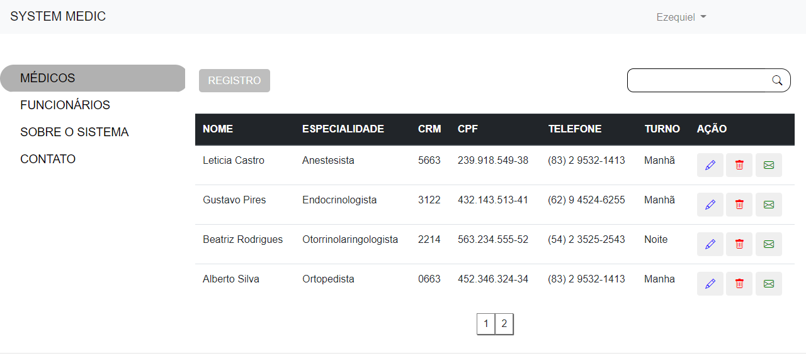
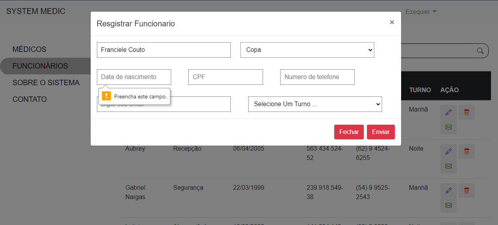
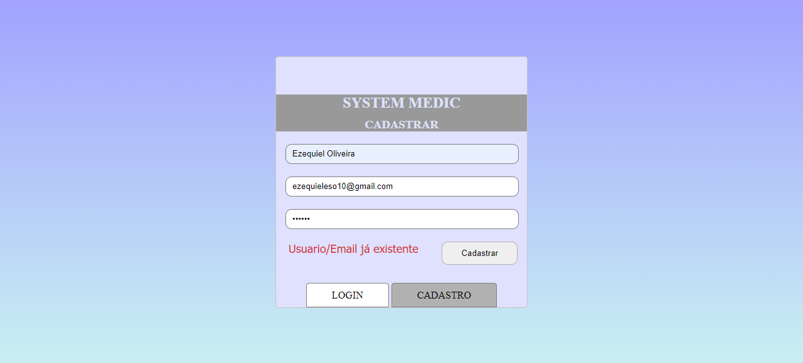
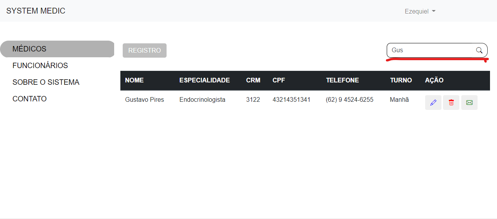

# Medical System

❗ Para facilitar o acesso do usuário, foi decidido hospedar esse site em um Host gratuito, que apesar de limitar em algumas funções, consegue executar bem as funções do site.
Acesse em: [**Medical System**](encurtador.com.br/buEV9)

---
<h1 align="center">
  
</h1>

---

# 🔎 Indice

- [Sobre](#-sobre)
- [Principais Funções](#-principais-funções)
- [Tecnologias Utilizadas](#-tecnologias-utilizadas)
- [Colaboradores]

---

## 🧾 Sobre

O **Medical System** é um sistema de gestão de pessoas (médicos e funcionários gerais) de um hospital fictício. Este sitema tem como intuito por em prática o conhecimento em desenvolvimento web, bem como, expor os desenvolvedores a novos desafios.

#### Detalhes do Sistema

Medical System é um sistema que tem como intuito passar a melhor expêriencia para o usuário, por isso todas as alterações são feitas de maneira assíncrona (não necessitando atualização da página para recarga dos dados).

O sistema por ser exclusivo para acesso em dispositivos com telas mais expansivas (Computadores e Notebooks), não houve a necessidade de fazer acessível para devices mobile e afins.

Este sistema oferece apenas uma hierarquia: a de administrador geral. Na qual o usuário tem total liberdade para adicionar, remover e editar registros de médicos e funcionários.

<h1 align="center">
  
</h1>   

Para obter acesso como administrador é necessário apenas criar um novo usuário utilizando um email que não foi cadastrado ainda.
<h1 align="center">
  
</h1>  

---

## 🔧 Principais Funções 

Algumas ferramentas foram adicionadas para melhorar a expêriencia do usuário.

A função de pesquisar um médico ou funcionário através do nome facilita em casos que haja muitos registros no sistema.

<h1 align="center">
  
</h1>   